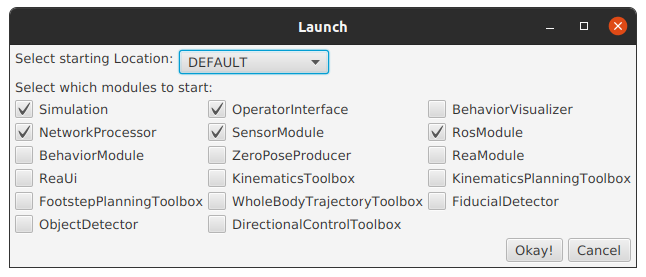

# Install standalone application on Ubuntu 22.04 (Recommended)

1. Install Java 17: `sudo apt install openjdk-17-jdk`
2. Download the latest release (`valkyrie-simulation-[version].deb`) from the [releases page](https://github.com/ihmcrobotics/valkyrie/releases).
3. Install the package:
    - Open your favorite terminal application (Ctrl+Alt+T)
    - `sudo dpkg -i valkyrie-simulation-[version].deb`
4. Shortly after the installation completed, the desktop application should be available in the application menu as `Valkyrie Obstacle Course` (`Super` key,
   then
   start looking up for Valkyrie).
5. If you want to run the simulation from the command line, you can add the following line to your `~/.bashrc`
   file: `export PATH=$PATH:/opt/valkyrie-simulation-[version]/bin`.
    - You can then run from the command line with: `ValkyrieObstacleCourseSCS2` or `ValkyrieObstacleCourseCLI`.

To uninstall, run: `sudo dpkg -r valkyrie-simulation`

# Configuring IHMC communication with ROS 2

The IHMC controller stack uses ROS 2 to communicate, i.e. to receive sensor data and send commands to the robot.
To configure the ROS 2 communication, you need to create the file `~/.ihmc/IHMCNetworkParameters.ini` with the following content:

```
RTPSDomainID=0
RTPSSubnet=192.168.1.0/24
```

- The `RTPSDomainID` is the ROS 2 domain ID (set to 0 in the example above).
  Make it match the domain ID of your ROS 2 network.
  If the environment variable `ROS_DOMAIN_ID` is specified, it will **override** whatever is in the parameter file.
  If not specified, it will be set to a random value.
- The `RTPSSubnet` is the subnet of the network interface used to communicate with the robot.
  This can be useful if you have multiple network interfaces on your computer and you want to force the IHMC controller stack to use a specific one.
  In the above example, IHMC software will only be able to communicate with computers on the `192.168.1.x` subnet.
  If you don't know what this is, you can remove this field from the configuration file.

You can also configure the ROS 2 domain ID using the `ROS_DOMAIN_ID` environment variable.

# Configuring IHMC communication with ROS 1

The IHMC controller stack publishes some topics like robot state on ROS 1.
To configure the ROS 1 communication, you need to create/edit the file `~/.ihmc/IHMCNetworkParameters.ini` with the following content:

```
rosURI=http://127.0.0.1:11311
```

The `rosURI` is the URI of the ROS 1 master.

You can also configure the ROS 1 communication using the `ROS_MASTER_URI` environment variable.

# `ValkyrieObstacleCourseNoUISCS2` Launch options

When launching the simulation, a popup window will appear as follows:



Some of the options are obsolete and will be removed in the future. Here's a description of the options:

- `Simulation`: whether to run the simulation or not. You want it checked.
- `NetworkProcessor`: whether to start ROS2 communication. You want it checked.
- `SensorModule`: whether to start the simulated sensor suite. Note that depth sensors are currently not supported.
- `RosModule`: whether to start ROS1 communication. This is optional and we don't fully support ROS1.
- `KinematicsToolbox`: Starts the Kinematics Toolbox. It provides a solver for inverse kinematics that is ROS2 enabled.
- `FootstepPlanningToolbox`: Starts the Footstep Planning Toolbox. It provides a solver for footstep planning that is ROS2 enabled.
- `DirectionalControlToolbox`: Starts a module that is ROS2 enabled and allows to control the robot using a joystick.
- `OperatorInterface`: [Obsolete] You can ignore it and leave unchecked.
- `BehaviorVisualizer`: [Obsolete] You can ignore it and leave unchecked.
- `BehaviorModule`: [Obsolete] You can ignore it and leave unchecked.
- `ZeroPoseProducer`: [Obsolete] You can ignore it and leave unchecked.
- `ReaModule`: [Obsolete] You can ignore it and leave unchecked.
- `ReaUi`: [Obsolete] You can ignore it and leave unchecked.
- `KinematicsPlanningToolbox`: [Obsolete] You can ignore it and leave unchecked.
- `WholeBodyTrajectoryToolbox`: [Obsolete] You can ignore it and leave unchecked.
- `FiducialDetector`: [Obsolete] You can ignore it and leave unchecked.
- `ObjectDetector`: [Obsolete] You can ignore it and leave unchecked.

# `ValkyrieObstacleCourseCLI` Launch options

When launching the simulation from the command line, you can specify the options as arguments.
Just run `ValkyrieObstacleCourseCLI --help` to see the available options.

# Further information and documentation

This is a work in progress, we'll be adding more documentation and tutorials soon.
